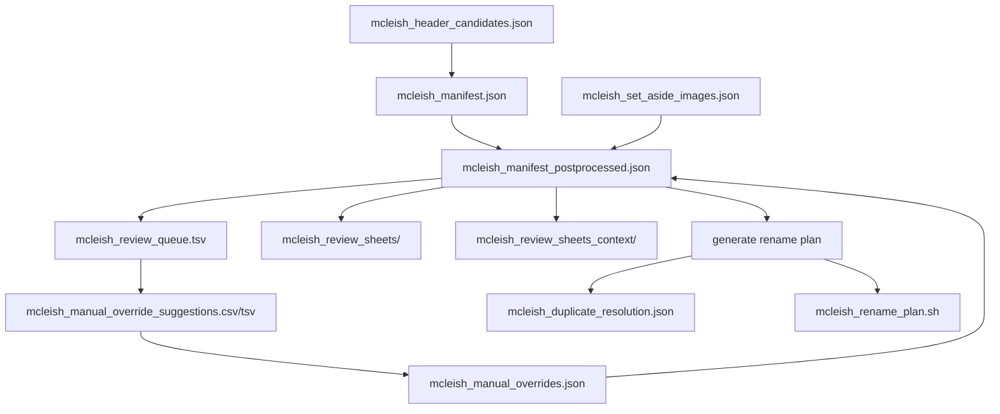

# Analysis data formats and relationships

This directory contains two analysis streams:

1. McLeish image/page-mapping workflow
2. Botanical characteristic and morphological analysis outputs

## Format types used

1. JSON: canonical machine-readable data with nested fields
2. TSV: human-review tables with tab separators
3. CSV: spreadsheet-friendly variants of review tables
4. JPEG directories: visual review sheets for manual adjudication

## McLeish workflow files

### 1) Raw OCR candidate extraction

- File: `mcleish_header_candidates.json`
- Format: JSON array
- Purpose: Stores OCR page-number candidates per source image before manifest normalization
- Producer: `bin/extract_mcleish_header_candidates.swift`
- Consumer: `bin/build_mcleish_manifest`

Schema (per array item):

- `image` (string): source image filename, for example `001.jpg`
- `bestPage` (integer or null): highest-scoring OCR page candidate
- `bestScore` (number): score of `bestPage`
- `needsReview` (boolean): whether OCR confidence requires manual review
- `candidates` (array): ranked OCR candidates

Candidate subfields:

- `page` (integer)
- `score` (number)
- `text` (string): OCR text snippet where page number was found
- `orientation` (string)
- `minX`, `minY` (number): normalized position of candidate text in the image

### 2) Normalized manifest (OCR-first)

- File: `mcleish_manifest.json`
- Format: JSON object
- Purpose: Canonical manifest used for postprocessing and review queue generation
- Producer: `bin/build_mcleish_manifest`
- Consumer: `bin/postprocess_mcleish_manifest.py`

Top-level fields:

- `schema_version` (integer)
- `generated_at` (string, timestamp)
- `source` (string): source glob for input images
- `note` (string): interpretation note for review logic
- `entries` (array)

Entry fields:

- `image` (string)
- `inferred_page` (integer or null): OCR-derived page
- `confidence_score` (number)
- `needs_review` (boolean)
- `top_candidates` (array): same candidate structure as above

### 3) Manual decisions and set-aside controls

- File: `mcleish_manual_overrides.json`
- Format: JSON object
- Purpose: Final manual page assignments keyed by image filename
- Producer: Manual edit or ingestion from suggestions CSV/TSV
- Consumer: `bin/postprocess_mcleish_manifest.py`

Schema:

- Key: image filename (string)
- Value: page number (integer)

Example:

- `"014.jpg": 14`

---

- File: `mcleish_set_aside_images.json`
- Format: JSON array of strings
- Purpose: Images intentionally excluded from rename/sequence resolution (for retake)
- Producer: Manual edit
- Consumer: `bin/postprocess_mcleish_manifest.py` and `bin/generate_mcleish_rename_plan.py`

Schema:

- Each item is an image filename (string)

### 4) Postprocessed manifest (decision-integrated)

- File: `mcleish_manifest_postprocessed.json`
- Format: JSON object
- Purpose: Integrates OCR anchors, strict interpolation, manual overrides, and set-aside markers
- Producer: `bin/postprocess_mcleish_manifest.py`
- Consumers: review exports, review-sheet renderers, rename-plan generator

Top-level fields:

- `schema_version` (integer)
- `generated_from` (string)
- `summary` (object): counts by assignment source
- `entries` (array)

Summary fields (current schema):

- `total_entries`
- `manual_override_entries`
- `set_aside_retake_entries`
- `ocr_anchor_entries`
- `strict_interpolation_entries`
- `ocr_low_confidence_entries`
- `unresolved_entries`

Entry fields:

- All manifest entry fields from `mcleish_manifest.json`
- `proposed_page` (integer or null): selected page assignment after postprocessing
- `proposed_source` (string enum):
  - `manual_override`
  - `set_aside_retake`
  - `ocr_anchor`
  - `strict_interpolation`
  - `ocr_low_confidence`
  - `unresolved`

### 5) Review queue tables

- Files:
  - `mcleish_review_queue.tsv`
  - `mcleish_review_queue.csv` (CSV variant; may be empty depending on export path)
- Format: TSV/CSV tabular review tables
- Purpose: Human triage queue for unresolved and low-confidence assignments
- Producer: `bin/export_mcleish_review_queue.py`
- Consumer: Human review

Columns:

1. `index`: 1-based sequence index in manifest order
2. `image`: source image filename
3. `inferred_page`: OCR best page
4. `proposed_page`: postprocessed chosen page
5. `proposed_source`: source of chosen page
6. `needs_review`: review flag
7. `confidence_score`: OCR confidence score
8. `candidate1_page`: first alternate candidate page
9. `candidate1_score`: first alternate score
10. `candidate1_text`: OCR text for first candidate
11. `candidate2_page`: second alternate candidate page
12. `candidate2_score`: second alternate score
13. `candidate2_text`: OCR text for second candidate

### 6) Manual override suggestion tables

- Files:
  - `mcleish_manual_override_suggestions.tsv`
  - `mcleish_manual_override_suggestions.csv`
- Format: TSV/CSV tabular worksheets
- Purpose: Focused list of unresolved entries with a writable `manual_page` column
- Producer: manual curation step (derived from unresolved rows)
- Consumer: ingestion step that updates `mcleish_manual_overrides.json`

Columns:

1. `index`: manifest sequence index
2. `image`: source image filename
3. `inferred_page`: OCR best page (often `None` for unresolved rows)
4. `cand1_page`: optional candidate page 1
5. `cand1_score`: optional candidate score 1
6. `cand1_text`: optional candidate text 1
7. `cand2_page`: optional candidate page 2
8. `cand2_score`: optional candidate score 2
9. `cand2_text`: optional candidate text 2
10. `manual_page`: manual final page number (integer)

### 7) Duplicate scan resolution

- File: `mcleish_duplicate_resolution.json`
- Format: JSON object
- Purpose: Records how the rename-plan generator automatically resolved pages
  with more than one image mapped to them (retaken or re-photographed
  captures). Multiple images legitimately sharing a `proposed_page` is not an
  error; the operator is never forced to discard a capture to unblock the
  rename plan.
- Producer: `bin/generate_mcleish_rename_plan.py`
- Consumer: human review (optional); no downstream tool requires it

Selection rule: among the images assigned to one page, prefer
`needs_review == false`, then higher `confidence_score`, then earlier
manifest order. The top-ranked scan is renamed to `NNN.jpg`; every other
scan of that page is kept (not discarded) and renamed to `NNN-scanK.jpg`
(`K` = 2, 3, ... best to worst) so it remains available to consult or
combine during genus text curation.

Top-level fields:

- `schema_version` (integer)
- `generated_from` (string)
- `selection_rule` (string): human-readable description of the ranking above
- `duplicate_pages` (integer): count of pages that had more than one image
- `pages` (array): one entry per duplicate page

`pages[]` entry fields:

- `page` (integer)
- `primary` (object): `image`, `renamed_to`, `confidence_score`, `needs_review`
- `alternates` (array of objects, best to worst): same fields as `primary`

To override the automatic pick, either correct `mcleish_manual_overrides.json`
so the intended images map to different pages, or add the unwanted capture to
`mcleish_set_aside_images.json`.

### 8) Visual review artifacts

- Directories:
  - `mcleish_review_sheets/` (queue sheets)
  - `mcleish_review_sheets_context/` (context sheets around unresolved indexes)
- Format: JPEG files
- Purpose: Rapid visual inspection to support manual adjudication
- Producer: `bin/render_mcleish_review_sheets.swift`
- Consumer: human review

## Botanical analysis outputs

### 1) Characteristic clustering output

- File: `characteristic_analysis.json`
- Format: JSON object
- Purpose: Category-level characteristic statistics and similarity artifacts
- Producer: `bin/analyze_characteristics.js` / `bin/analyze_characteristics.py`

Primary fields:

- `statistics`
  - `total_genera`
  - `total_characteristics`
  - `characteristics_per_genus`
  - `genera_per_characteristic`
- `characteristics_list`
- additional similarity/cluster structures depending on analyzer version

### 2) Morphological feature analysis output

- File: `morphological_analysis.json`
- Format: JSON object
- Purpose: Fine-grained feature-level extraction and term analysis
- Producer: `bin/analyze_morphological_features.js`

Primary fields:

- `statistics`
  - `total_genera`
  - `total_unique_features`
  - `features_per_genus`
  - `total_unique_terms`
- `genera`
  - per-genus `features` arrays with fields such as:
    - `category`
    - `subcategory`
    - `description`
    - `fullPath`
    - `fullDescription`

## Relationship map

## Relationship notes

1. `mcleish_manifest.json` is the baseline machine output; no manual decisions applied.
2. `mcleish_manifest_postprocessed.json` is the authoritative operational state for review and rename planning.
3. `mcleish_manual_overrides.json` and `mcleish_set_aside_images.json` are control inputs that override or exclude entries.
4. Review tables (`review_queue`, `manual_override_suggestions`) are analyst-facing derivatives, not canonical source-of-truth stores.
5. Rename planning requires one condition on non-set-aside entries: no
   `proposed_page == null`. Multiple entries sharing a `proposed_page` are not
   a blocker; they are resolved automatically and recorded in
   `mcleish_duplicate_resolution.json` (see above).