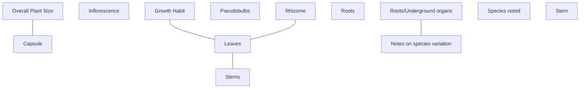
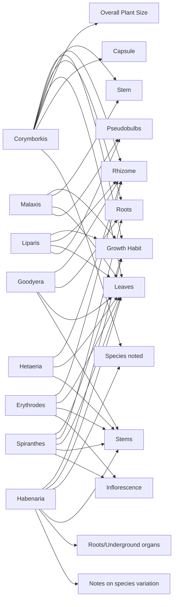

# Characteristic Clustering Analysis

## Clustering Statistics

- **Total Genera**: 8
- **Total Characteristics**: 13
- **Average characteristics per genus**: 4.8
- **Most common characteristic**: Leaves (8 genera)
- **Least common characteristics**: Capsule (1), Roots/Underground organs (1), Notes on species variation (1)

### Strongest Characteristic Relationships (Jaccard Similarity)

- **Capsule** ↔ **Overall Plant Size**: 100.0% overlap
- **Notes on species variation** ↔ **Roots/Underground organs**: 100.0% overlap
- **Growth Habit** ↔ **Leaves**: 62.5% overlap
- **Leaves** ↔ **Rhizome**: 62.5% overlap
- **Leaves** ↔ **Stems**: 62.5% overlap

## Distance Measures

Three distance/similarity measures were used:

1. **Co-occurrence**: How often characteristic pairs appear in the same genus
2. **Jaccard Similarity**: Overlap in the set of genera possessing each characteristic
   - Formula: J(A,B) = |A ∩ B| / |A ∪ B|
   - Range: 0 (no overlap) to 1 (identical)
3. **Semantic Grouping**: Expert-defined functional/anatomical categories

## Visualization A: Semantic Hierarchy

This shows characteristics organized by botanical function:

```mermaid
graph TD
  Root["Orchid Vegetative Characteristics"]
  Root --> C0["Underground Structures"]
  C0 --> C0_0["Rhizome"]
  C0 --> C0_1["Roots"]
  C0 --> C0_2["Roots/Underground organs"]
  C0 --> C0_3["Pseudobulbs"]
  Root --> C1["Stem Characteristics"]
  C1 --> C1_0["Stem"]
  C1 --> C1_1["Stems"]
  Root --> C2["Leaf Attributes"]
  C2 --> C2_0["Leaves"]
  C2 --> C2_1["Arrangement"]
  C2 --> C2_2["Attachment"]
  C2 --> C2_3["Position"]
  C2 --> C2_4["Texture"]
  C2 --> C2_5["Shape"]
  C2 --> C2_6["Sheath"]
  C2 --> C2_7["Sheaths"]
  C2 --> C2_8["Size"]
  C2 --> C2_9["Dimensions"]
  C2 --> C2_10["Number"]
  C2 --> C2_11["Venation"]
  C2 --> C2_12["Surface"]
  C2 --> C2_13["Persistence"]
  Root --> C3["Growth Form"]
  C3 --> C3_0["Growth Habit"]
  C3 --> C3_1["Overall Plant Size"]
  Root --> C4["Reproductive Structures"]
  C4 --> C4_0["Inflorescence"]
  C4 --> C4_1["Capsule"]
  Root --> C5["Metadata"]
  C5 --> C5_0["Species noted"]
  C5 --> C5_1["Notes on species variation"]
```

## Visualization B: Characteristic Network

Characteristics connected by Jaccard similarity > 0.5:

## Visualization C: Genera-Characteristic Relationships

Bipartite graph showing which genera possess which characteristics:

## Visualization D: Presence/Absence Matrix

Quick reference table (● = present, ○ = absent):

| Genus | Capsule | Growth Hab | Infloresce | Leaves | Notes on s | Overall Pl | Pseudobulb | Rhizome | Roots | Roots/Unde | Species no | Stem | Stems |
|---------------|------------|------------|------------|------------|------------|------------|------------|------------|------------|------------|------------|------------|------------|
| Corymborkis   | ●          | ●          | ○          | ●          | ○          | ●          | ○          | ●          | ●          | ○          | ●          | ●          | ○          |
| Erythrodes    | ○          | ○          | ●          | ●          | ○          | ○          | ○          | ●          | ○          | ○          | ○          | ○          | ●          |
| Goodyera      | ○          | ○          | ○          | ●          | ○          | ○          | ○          | ●          | ●          | ○          | ○          | ○          | ●          |
| Habenaria     | ○          | ●          | ○          | ●          | ●          | ○          | ○          | ○          | ○          | ●          | ●          | ○          | ●          |
| Hetaeria      | ○          | ○          | ○          | ●          | ○          | ○          | ○          | ●          | ○          | ○          | ○          | ○          | ●          |
| Liparis       | ○          | ●          | ○          | ●          | ○          | ○          | ●          | ●          | ○          | ○          | ○          | ○          | ○          |
| Malaxis       | ○          | ●          | ○          | ●          | ○          | ○          | ●          | ○          | ○          | ○          | ○          | ●          | ○          |
| Spiranthes    | ○          | ●          | ●          | ●          | ○          | ○          | ○          | ○          | ●          | ○          | ○          | ○          | ●          |

