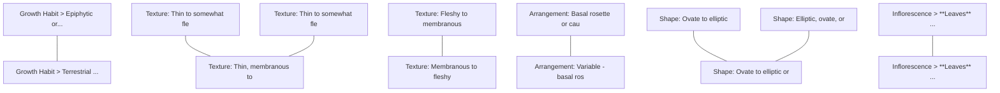

# Belize Orchid Genera - Vegetative Characteristics
## Source: McLeish Pages 13, 15, 41-48

## Table of Contents
- [Corymborkis](#genus-corymborkis-thou)
- [Erythrodes](#genus-erythrodes-bl)
- [Goodyera](#genus-goodyera-r-br)
- [Habenaria](#genus-habenaria-willd)
- [Hetaeria](#genus-hetaeria-bl)
- [Liparis](#genus-liparis-rich)
- [Malaxis](#genus-malaxis-sol-ex-sw)
- [Spiranthes](#genus-spiranthes-rich)

---

## TRIBE TROPIDEAE DRESSLER

### Genus: Corymborkis Thou.

**Growth Habit:**
- Terrestrial plants

**Rhizome:**
- Short
- Sympodial
- Creeping

**Roots:**
- Fasciculate (clustered)
- Wiry

**Stem:**
- Deciduous
- Slender
- Terete (cylindrical)
- Tapering
- Leafy

**Leaves:**
- **Arrangement:** Alternate in 2 series OR spirally arranged
- **Attachment:** Sessile
- **Position:** Distichous (in two ranks)
- **Texture:** Flat, plicate (pleated), thin
- **Sheaths:** Well-developed
- **Dimensions:** 5 to 30 cm long and 1 to 4 cm wide
- **Number:** 25 or more leaves

**Overall Plant Size:**
- Thin terrestrial
- Tall and erect
- 50 cm to 2 m tall

**Capsule:**
- 3-angled
- Thin-walled
- Erect

**Species noted:** C. forcipigera

---

## SUBTRIBE GOODYERINAE KLOTZSCH

### Genus: Erythrodes Bl.

**Rhizome:**
- Creeping rhizome with short, erect, vertical branches

**Stems:**
- Erect
- Sheathed by bracts at the base of peduncle

**Leaves:**
- **Texture:** Membranous
- **Shape:** Elliptic-ovate
- **Attachment:** Petiolate (with petiole)
- **Sheath:** Infundibuliform (funnel-shaped)
- **Arrangement:** 2-ranked

**Inflorescence:**
- Terminal raceme or corymb

---

### Genus: Goodyera R. Br.

**Rhizome:**
- Fleshy
- Creeping

**Stems:**
- Short
- Erect

**Leaves:**
- **Arrangement:** Basal rosette or cauline (stem leaves)
- **Texture:** Fleshy to membranous
- **Venation:** Often marked with white or pale veins
- **Shape:** Ovate to lanceolate
- **Attachment:** Petiolate or sessile

**Roots:**
- Fleshy
- From rhizome nodes

---

### Genus: Habenaria Willd.

**Growth Habit:**
- Terrestrial

**Roots/Underground organs:**
- Tubers (rounded or ovoid) OR
- Fleshy, tuberous roots
- Variable in form: some species with single rounded tuber, others with fleshy fasciculate roots

**Stems:**
- Erect
- Leafy
- Slender to stout depending on species
- Height variable: from 10-15 cm to over 50 cm

**Leaves:**
- **Arrangement:** Variable - basal rosette, cauline (along stem), or both
- **Number:** 1 to several leaves
- **Shape:** Variable by species - lanceolate, ovate, elliptic, oblong, linear
- **Texture:** Thin to somewhat fleshy, membranous to slightly succulent
- **Size:** Highly variable (2-30 cm long, 0.5-4 cm wide depending on species)
- **Attachment:** Sessile or with short petiole, sheathing at base
- **Position:** Basal, appressed to ground, spreading, or clasping stem
- **Surface:** Green, sometimes with pale or darker markings
- **Persistence:** Present at flowering in most species

**Notes on species variation:**
- H. alata: leaves lanceolate, acute
- H. brachyceras: rounded tuber, leaves small, oblong-elliptic
- H. distans: leaves lanceolate, basal
- H. floribunda: leaves lanceolate to ovate, cauline
- H. monorrhiza: leaves ovate-lanceolate, spreading
- H. odontopetala: leaves oblanceolate, basal
- H. quinqueseta: leaves ovate to elliptic
- H. repens: leaves ovate to oblong, shady habitats

**Species noted:** H. alata, H. brachyceras, H. distans, H. floribunda, H. monorrhiza, H. odontopetala, H. quinqueseta, H. repens (and others)

---

### Genus: Hetaeria Bl.

**Rhizome:**
- Creeping

**Stems:**
- Erect
- Slender

**Leaves:**
- **Texture:** Membranous to fleshy
- **Arrangement:** Several along stem or in basal rosette
- **Shape:** Ovate to elliptic
- **Venation:** Sometimes marked with lighter veins
- **Attachment:** Petiolate with tubular sheath

---

## TRIBE MALAXIDEAE

### Genus: Liparis Rich.

**Growth Habit:**
- Epiphytic or terrestrial

**Pseudobulbs:**
- Present
- Ovoid to elongate
- Clustered or well-spaced on rhizome

**Rhizome:**
- Creeping to abbreviated

**Leaves:**
- **Number:** 1-several per pseudobulb
- **Texture:** Thin to somewhat fleshy
- **Shape:** Elliptic, ovate, or lanceolate
- **Venation:** Plicate or non-plicate
- **Attachment:** Petiolate or subsessile
- **Arrangement:** Basal from pseudobulb apex

---

### Genus: Malaxis Sol. ex Sw.

**Growth Habit:**
- Terrestrial or epiphytic

**Pseudobulbs:**
- Small
- Often clustered
- Ovoid to subglobose

**Leaves:**
- **Number:** 1-several
- **Position:** Terminal on pseudobulb or along stem
- **Texture:** Thin, membranous to somewhat fleshy
- **Shape:** Ovate to elliptic or lanceolate
- **Venation:** Plicate or not
- **Attachment:** Usually sessile or subsessile

**Stem:**
- Sometimes elongated between pseudobulbs

---

### Genus: Spiranthes Rich.

**Growth Habit:**
- Terrestrial

**Roots:**
- Fleshy
- Fasciculate
- Tuberous or cylindrical

**Stems:**
- Erect
- Slender

**Leaves:**
- **Arrangement:** Basal rosette or along stem
- **Texture:** Thin to somewhat fleshy
- **Shape:** Linear to lanceolate or ovate
- **Attachment:** Sessile or with short sheath
- **Persistence:** May be absent at flowering (leaves deciduous in some species)

**Inflorescence:**
- Terminal spike with flowers typically in spiral arrangement

---

## Notes
- Pages from Chapter 3: Species descriptions
- **Page 13:** Corymborkis, Erythrodes
- **Page 15:** Goodyera, Hetaeria, Liparis, Malaxis, Spiranthes
- **Pages 41-48:** Habenaria (continuous description with 8+ species)
- Key distinguishing features:
  - **Corymborkis:** Notably tall (up to 2m) with plicate leaves, terrestrial
  - **Erythrodes:** Membranous, petiolate leaves with funnel-shaped sheaths
  - **Goodyera & Hetaeria:** Creeping rhizomes with often decoratively veined leaves
  - **Habenaria:** Terrestrial with tubers or tuberous roots, highly variable leaf morphology across species
  - **Liparis & Malaxis:** Pseudobulbous epiphytes/terrestrials (Tribe Malaxideae)
  - **Spiranthes:** Terrestrial with fleshy fasciculate roots, spiral flower arrangement
# Morphological Feature Clustering Analysis

## Overview

This analysis operates at the **morphological feature level**, examining specific
descriptive characteristics rather than broad categories.

## Statistics

- **Total Genera**: 8
- **Total Unique Morphological Features**: 116
- **Total Unique Morphological Terms**: 190
- **Similarity Clusters Found**: 87
- **Average features per genus**: 15.8

### Features per Genus

- **Spiranthes Rich.**: 27 features
- **Habenaria Willd.**: 25 features
- **Corymborkis Thou.**: 24 features
- **Goodyera R. Br.**: 11 features
- **Liparis Rich.**: 11 features
- **Malaxis Sol. ex Sw.**: 11 features
- **Erythrodes Bl.**: 9 features
- **Hetaeria Bl.**: 8 features

---

## Example Feature Similarities

Morphological features with high semantic similarity (based on shared descriptive terms):

| Similarity | Feature 1 | Feature 2 |
|------------|-----------|------------|
| 100% | Growth Habit > Epiphytic or terrestrial | Growth Habit > Terrestrial or epiphytic |
| 100% | Leaves > Texture > Fleshy to membranous | Leaves > Texture > Membranous to fleshy |
| 100% | Leaves > Shape > Elliptic, ovate, or lanceolate | Leaves > Shape > Ovate to elliptic or lanceolate |
| 75% | Leaves > Texture > Thin to somewhat fleshy | Leaves > Texture > Thin, membranous to somewhat fleshy |
| 67% | Leaves > Texture > Thin to somewhat fleshy, membranous to... | Leaves > Texture > Thin, membranous to somewhat fleshy |
| 67% | Leaves > Shape > Ovate to elliptic | Leaves > Shape > Ovate to elliptic or lanceolate |
| 60% | Leaves > Arrangement > Basal rosette or cauline (stem lea... | Leaves > Arrangement > Variable - basal rosette, cauline ... |
| 60% | Inflorescence > **Leaves** ↔ **Rhizome**: 62.5% overlap | Inflorescence > **Leaves** ↔ **Stems**: 62.5% overlap |
| 50% | Growth Habit > Terrestrial | Growth Habit > Terrestrial or epiphytic |
| 50% | Rhizome > Creeping | Rhizome > Creeping to abbreviated |
| 50% | Leaves > Texture > Membranous | Leaves > Texture > Membranous to fleshy |
| 50% | Leaves > Texture > Fleshy to membranous | Leaves > Texture > Thin, membranous to somewhat fleshy |
| 50% | Leaves > Texture > Membranous to fleshy | Leaves > Texture > Thin, membranous to somewhat fleshy |
| 50% | Leaves > Attachment > Petiolate (with petiole) | Leaves > Attachment > Petiolate or sessile |
| 50% | Leaves > Attachment > Petiolate (with petiole) | Leaves > Attachment > Petiolate or subsessile |
| 50% | Leaves > Shape > Elliptic, ovate, or lanceolate | Leaves > Shape > Linear to lanceolate or ovate |

---

## Morphological Feature Clusters

Groups of features with high semantic similarity (sharing morphological terms):

### Cluster 1: 5 related features

- **Leaves > Shape > Ovate to lanceolate**
  - Genera: Goodyera R. Br.
- **Leaves > Shape > Ovate to elliptic**
  - Genera: Hetaeria Bl.
- **Leaves > Shape > Elliptic, ovate, or lanceolate**
  - Genera: Liparis Rich.
- **Leaves > Shape > Ovate to elliptic or lanceolate**
  - Genera: Malaxis Sol. ex Sw.
- **Leaves > Shape > Linear to lanceolate or ovate**
  - Genera: Spiranthes Rich.

### Cluster 2: 4 related features

- **Growth Habit > Terrestrial plants**
  - Genera: Corymborkis Thou.
- **Growth Habit > Terrestrial**
  - Genera: Habenaria Willd., Spiranthes Rich.
- **Growth Habit > Epiphytic or terrestrial**
  - Genera: Liparis Rich.
- **Growth Habit > Terrestrial or epiphytic**
  - Genera: Malaxis Sol. ex Sw.

### Cluster 3: 4 related features

- **Leaves > Attachment > Sessile**
  - Genera: Corymborkis Thou.
- **Leaves > Attachment > Petiolate or sessile**
  - Genera: Goodyera R. Br.
- **Leaves > Attachment > Usually sessile or subsessile**
  - Genera: Malaxis Sol. ex Sw.
- **Leaves > Attachment > Sessile or with short sheath**
  - Genera: Spiranthes Rich.

### Cluster 4: 4 related features

- **Leaves > Arrangement > Basal rosette or cauline (stem leaves)**
  - Genera: Goodyera R. Br.
- **Leaves > Arrangement > Variable - basal rosette, cauline (along stem), or both**
  - Genera: Habenaria Willd.
- **Leaves > Arrangement > Several along stem or in basal rosette**
  - Genera: Hetaeria Bl.
- **Leaves > Arrangement > Basal rosette or along stem**
  - Genera: Spiranthes Rich.

### Cluster 5: 3 related features

- **Leaves > Texture > Membranous**
  - Genera: Erythrodes Bl.
- **Leaves > Texture > Fleshy to membranous**
  - Genera: Goodyera R. Br.
- **Leaves > Texture > Membranous to fleshy**
  - Genera: Hetaeria Bl.

### Cluster 6: 3 related features

- **Leaves > Attachment > Petiolate (with petiole)**
  - Genera: Erythrodes Bl.
- **Leaves > Attachment > Petiolate with tubular sheath**
  - Genera: Hetaeria Bl.
- **Leaves > Attachment > Petiolate or subsessile**
  - Genera: Liparis Rich.

### Cluster 7: 3 related features

- **Leaves > Texture > Thin to somewhat fleshy, membranous to slightly succulent**
  - Genera: Habenaria Willd.
- **Leaves > Texture > Thin to somewhat fleshy**
  - Genera: Liparis Rich., Spiranthes Rich.
- **Leaves > Texture > Thin, membranous to somewhat fleshy**
  - Genera: Malaxis Sol. ex Sw.

---

## Visualization: Feature Similarity Network

This network shows morphological features (nodes) connected by semantic similarity (edges).
Only features with >60% term overlap are shown.

---

## Feature Comparison by Category

### Leaves

#### Arrangement

| Description | Genera |
|-------------|--------|
| Alternate in 2 series OR spirally arranged | Corymborkis |
| 2-ranked | Erythrodes |
| Basal rosette or cauline (stem leaves) | Goodyera |
| Variable - basal rosette, cauline (along stem), or both | Habenaria |
| Several along stem or in basal rosette | Hetaeria |
| Basal from pseudobulb apex | Liparis |
| Basal rosette or along stem | Spiranthes |

#### Attachment

| Description | Genera |
|-------------|--------|
| Sessile | Corymborkis |
| Petiolate (with petiole) | Erythrodes |
| Petiolate or sessile | Goodyera |
| Sessile or with short petiole, sheathing at base | Habenaria |
| Petiolate with tubular sheath | Hetaeria |
| Petiolate or subsessile | Liparis |
| Usually sessile or subsessile | Malaxis |
| Sessile or with short sheath | Spiranthes |

#### Position

| Description | Genera |
|-------------|--------|
| Distichous (in two ranks) | Corymborkis |
| Basal, appressed to ground, spreading, or clasping stem | Habenaria |
| Terminal on pseudobulb or along stem | Malaxis |

#### Texture

| Description | Genera |
|-------------|--------|
| Flat, plicate (pleated), thin | Corymborkis |
| Membranous | Erythrodes |
| Fleshy to membranous | Goodyera |
| Thin to somewhat fleshy, membranous to slightly succulent | Habenaria |
| Membranous to fleshy | Hetaeria |
| Thin to somewhat fleshy | Liparis, Spiranthes |
| Thin, membranous to somewhat fleshy | Malaxis |

#### Number

| Description | Genera |
|-------------|--------|
| 25 or more leaves | Corymborkis |
| 1 to several leaves | Habenaria |
| 1-several per pseudobulb | Liparis |
| 1-several | Malaxis |

#### Shape

| Description | Genera |
|-------------|--------|
| Elliptic-ovate | Erythrodes |
| Ovate to lanceolate | Goodyera |
| Variable by species - lanceolate, ovate, elliptic, oblong, linear | Habenaria |
| Ovate to elliptic | Hetaeria |
| Elliptic, ovate, or lanceolate | Liparis |
| Ovate to elliptic or lanceolate | Malaxis |
| Linear to lanceolate or ovate | Spiranthes |

#### Venation

| Description | Genera |
|-------------|--------|
| Often marked with white or pale veins | Goodyera |
| Sometimes marked with lighter veins | Hetaeria |
| Plicate or non-plicate | Liparis |
| Plicate or not | Malaxis |

#### Persistence

| Description | Genera |
|-------------|--------|
| Present at flowering in most species | Habenaria |
| May be absent at flowering (leaves deciduous in some species) | Spiranthes |

### Roots

#### General

| Description | Genera |
|-------------|--------|
| Fasciculate (clustered) | Corymborkis |
| Wiry | Corymborkis |
| Fleshy | Goodyera, Spiranthes |
| From rhizome nodes | Goodyera |
| Fasciculate | Spiranthes |
| Tuberous or cylindrical | Spiranthes |

### Rhizome

#### General

| Description | Genera |
|-------------|--------|
| Short | Corymborkis |
| Sympodial | Corymborkis |
| Creeping | Corymborkis, Goodyera, Hetaeria |
| Creeping rhizome with short, erect, vertical branches | Erythrodes |
| Fleshy | Goodyera |
| Creeping to abbreviated | Liparis |

### Stems

#### General

| Description | Genera |
|-------------|--------|
| Erect | Erythrodes, Goodyera, Habenaria, Hetaeria, Spiranthes |
| Sheathed by bracts at the base of peduncle | Erythrodes |
| Short | Goodyera |
| Leafy | Habenaria |
| Slender to stout depending on species | Habenaria |
| Height variable: from 10-15 cm to over 50 cm | Habenaria |
| Slender | Hetaeria, Spiranthes |

### Growth Habit

#### General

| Description | Genera |
|-------------|--------|
| Terrestrial plants | Corymborkis |
| Terrestrial | Habenaria, Spiranthes |
| Epiphytic or terrestrial | Liparis |
| Terrestrial or epiphytic | Malaxis |

---

## Morphological Term Ontology

Terms organized by the morphological context in which they appear:

### Capsule

**Terms**: 3-angled, erect, thin-walled

### Growth Habit

**Terms**: epiphytic, plants, terrestrial

### Inflorescence > Page 13

**Terms**: corymborkis, erythrodes

### Inflorescence > Page 15

**Terms**: goodyera, hetaeria, liparis, malaxis, spiranthes

### Inflorescence > Pages 41-48

**Terms**: habenaria

### Inflorescence

**Terms**: **average, **capsule**, **growth, **least, **leaves**, **leaves**:, **most, **notes, **overall, **rhizome**:, **roots, **stems**:, **total, 100.0%, 4.8, 62.5%, arrangement, capsule, chapter, characteristic**:, characteristics, characteristics**:, common, corymb, descriptions, distinguishing, features, flowers, from, genera**:, genus**:, habit**, key, leaves, notes, organs, organs**:, overlap, pages, per, plant, raceme, roots, size**:, species, spike, spiral, terminal, typically, underground, variation, variation**

### Leaves > Arrangement

**Terms**: 2-ranked, along, alternate, apex, arranged, basal, both, cauline, from, pseudobulb, rosette, series, several, spirally, stem, variable

### Leaves > Attachment

**Terms**: base, petiolate, petiole, sessile, sheath, sheathing, short, subsessile, tubular, usually

### Leaves > Dimensions

**Terms**: long, wide

### Leaves > Number

**Terms**: 1-several, leaves, more, per, pseudobulb, several

### Leaves > Persistence

**Terms**: absent, flowering, may, most, present, species

### Leaves > Position

**Terms**: along, appressed, basal, clasping, distichous, ground, pseudobulb, spreading, stem, terminal

### Leaves > Shape

**Terms**: elliptic, elliptic-ovate, lanceolate, linear, oblong, ovate, species, variable

### Leaves > Sheath

**Terms**: infundibuliform

### Leaves > Sheaths

**Terms**: well-developed

### Leaves > Size

**Terms**: highly, variable

### Leaves > Surface

**Terms**: darker, green, markings, pale, sometimes

### Leaves > Texture

**Terms**: flat, fleshy, membranous, plicate, slightly, somewhat, succulent, thin

### Leaves > Venation

**Terms**: lighter, marked, non-plicate, not, often, pale, plicate, sometimes, veins, white

### Notes on species variation

**Terms**: acute, alata:, basal, brachyceras:, cauline, distans:, elliptic, floribunda:, habitats, lanceolate, leaves, monorrhiza:, oblanceolate, oblong, oblong-elliptic, odontopetala:, ovate, ovate-lanceolate, quinqueseta:, repens:, rounded, shady, small, spreading, tuber

### Overall Plant Size

**Terms**: erect, tall, terrestrial, thin

### Pseudobulbs

**Terms**: clustered, elongate, often, ovoid, present, rhizome, small, subglobose, well-spaced

### Rhizome

**Terms**: abbreviated, branches, creeping, erect, fleshy, rhizome, short, sympodial, vertical

### Roots

**Terms**: cylindrical, fasciculate, fleshy, from, nodes, rhizome, tuberous, wiry

### Roots/Underground organs

**Terms**: fasciculate, fleshy, form:, others, roots, rounded, single, some, species, tuber, tuberous, tubers, variable

### Stem

**Terms**: between, deciduous, elongated, leafy, pseudobulbs, slender, sometimes, tapering, terete

### Stems

**Terms**: 10-15, base, bracts, depending, erect, from, height, leafy, over, peduncle, sheathed, short, slender, species, stout, variable:

