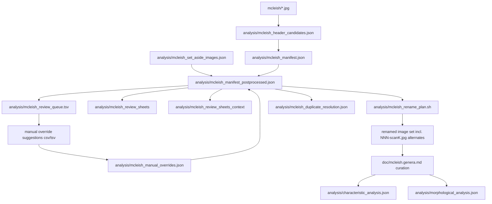

# Page images to completed genera analysis process

- [Page images to completed genera analysis process](#page-images-to-completed-genera-analysis-process)
  - [Process design](#process-design)
  - [Purpose](#purpose)
  - [Scope and assumptions](#scope-and-assumptions)
  - [Tooling prerequisites](#tooling-prerequisites)
  - [Data model summary](#data-model-summary)
  - [End-to-end procedure](#end-to-end-procedure)
    - [Phase 0: Prepare inputs](#phase-0-prepare-inputs)
    - [Phase 1: Extract OCR page candidates and build base manifest](#phase-1-extract-ocr-page-candidates-and-build-base-manifest)
    - [Phase 2: Integrate manual controls and resolve proposals](#phase-2-integrate-manual-controls-and-resolve-proposals)
    - [Phase 3: Build human review artifacts](#phase-3-build-human-review-artifacts)
    - [Phase 4: Adjudicate unresolved entries and feed back decisions](#phase-4-adjudicate-unresolved-entries-and-feed-back-decisions)
    - [Phase 5: Automatic duplicate-scan resolution](#phase-5-automatic-duplicate-scan-resolution)
    - [Phase 6: Emit and execute rename plan](#phase-6-emit-and-execute-rename-plan)
    - [Phase 7: Curate genus source text](#phase-7-curate-genus-source-text)
    - [Phase 8: Generate characteristic-level analysis](#phase-8-generate-characteristic-level-analysis)
    - [Phase 9: Generate morphological feature analysis](#phase-9-generate-morphological-feature-analysis)
    - [Phase 10: Completion checks](#phase-10-completion-checks)
  - [Troubleshooting](#troubleshooting)
    - [OCR appears weak across many pages](#ocr-appears-weak-across-many-pages)
    - [The tool picked the wrong scan as primary for a page](#the-tool-picked-the-wrong-scan-as-primary-for-a-page)
    - [Suggested CSV/TSV ingestion rules](#suggested-csvtsv-ingestion-rules)
  - [Pipeline relationship diagram](#pipeline-relationship-diagram)
  - [Metadata](#metadata)

## Process design

This workflow exists because the project starts with photographs of book pages,
but the project goal is not a photo archive. The goal is a reliable botanical
analysis of genera, based on structured and reviewable evidence.

From a botanist's perspective, the core challenge is this:

1. Many page images are easy to place in order
2. Some are ambiguous, duplicated, or low quality
3. A few may need to be retaken
4. Analysis is only trustworthy after page placement is stable

The process therefore separates the work into two linked parts:

1. **Evidence ordering**: Determine which page each image represents
2. **Biological interpretation**: Use the stabilized source to extract and
   analyze genus characteristics

Why this separation matters:

- If page mapping is unstable, downstream analysis can mix characters from the
  wrong taxa
- If ambiguous images are forced into sequence too early, errors are hidden
- If uncertain images are explicitly flagged, the rest of the corpus can still
  progress

### Conceptual flow

The design follows a conservative evidence pipeline:

1. **Machine proposal**: OCR suggests page numbers
2. **Human adjudication**: unresolved or low-confidence cases are reviewed
3. **Explicit exceptions**: unusable images are set aside for retake
4. **Consistency checks**: unresolved items and page collisions are treated as
   blockers
5. **Controlled finalization**: only then is page renaming/ordering finalized
6. **Genus analysis**: feature extraction and clustering run on curated text

This is intentionally similar to classical taxonomic practice:

- start from observations,
- separate strong from weak evidence,
- record judgment calls explicitly,
- and only then produce comparative analysis.

### Process definition used in this runbook

The executable process below is the operational form of that design:

1. Generate OCR-based candidates and a base manifest
2. Integrate manual overrides and retake set-asides
3. Produce review artifacts for ambiguous records
4. Iterate until unresolved items are handled and collisions are resolved
5. Emit a safe rename plan for active images
6. Curate genus text from the stabilized page set
7. Run characteristic and morphological analyses

In short, the commands in later sections are not just implementation details;
they enforce data quality gates that protect botanical validity.

## Purpose

This runbook describes the end-to-end workflow for taking a directory of page
images and producing completed genera analysis artifacts in this repository.

The process has two major tracks:

1. Build a reliable page mapping for the McLeish image set
2. Build and refresh genus-level analytical outputs from curated source text

## Scope and assumptions

- Working directory is the repository root
- Input images are in the `mcleish/` directory
- Image names are stable and unique (for example `001.jpg`, `067-2.jpg`)
- Page numbers refer to source document page numbers, not image sequence index
- `analysis/` is the canonical output directory for machine-readable artifacts

## Tooling prerequisites

Required executables used by this workflow:

- `docker`
- `swift`
- `jq`
- `python3`
- `node`

Key scripts in this repository:

- `bin/extract_mcleish_header_candidates.swift`
- `bin/build_mcleish_manifest`
- `bin/postprocess_mcleish_manifest.py`
- `bin/export_mcleish_review_queue.py`
- `bin/render_mcleish_review_sheets.swift`
- `bin/generate_mcleish_rename_plan.py`
- `bin/analyze_characteristics.js`
- `bin/visualize_clusters.js`
- `bin/analyze_morphological_features.js`
- `bin/visualize_morphological_clusters.js`

## Data model summary

Control inputs:

- `analysis/mcleish_manual_overrides.json` (image -> integer page)
- `analysis/mcleish_set_aside_images.json` (image filenames to exclude for retake)

Primary generated artifacts:

- `analysis/mcleish_header_candidates.json`
- `analysis/mcleish_manifest.json`
- `analysis/mcleish_manifest_postprocessed.json`
- `analysis/mcleish_review_queue.tsv`
- `analysis/mcleish_review_sheets/` and `analysis/mcleish_review_sheets_context/`
- `analysis/mcleish_duplicate_resolution.json` (auto-resolved same-page duplicates)
- `analysis/mcleish_rename_plan.sh`

Analysis outputs:

- `analysis/characteristic_analysis.json`
- `analysis/morphological_analysis.json`
- `doc/clustering_section.md`
- `doc/morphological_clustering.md`

Reference schema and relationships are documented in `analysis/README.md`.

## End-to-end procedure

### Phase 0: Prepare inputs

1. Place source images in `mcleish/`.
2. Verify filenames are unique and stable.
3. Remove obvious non-pages or broken captures before OCR (optional).

Example checks:

```bash
ls -1 mcleish | head
ls -1 mcleish | wc -l
```

### Phase 1: Extract OCR page candidates and build base manifest

Run:

```bash
bin/build_mcleish_manifest
```

What this does:

1. Runs OCR candidate extraction into `analysis/mcleish_header_candidates.json`
2. Normalizes results into `analysis/mcleish_manifest.json`
3. Records `inferred_page`, `confidence_score`, `needs_review`, `top_candidates`

Quality gate:

- Confirm the manifest exists and contains expected entry count

```bash
jq '.entries | length' analysis/mcleish_manifest.json
```

### Phase 2: Integrate manual controls and resolve proposals

Optional control files:

- `analysis/mcleish_manual_overrides.json`
- `analysis/mcleish_set_aside_images.json`

What the botanist is expected to do in this phase:

1. Review unresolved or suspicious entries from the latest queue/context sheets
2. Decide one of three actions per image:
  - assign a page number with high confidence,
  - leave it unresolved for another pass,
  - or mark it as a retake candidate
3. Record those decisions by editing the control files directly

How to edit each control file:

1. `analysis/mcleish_manual_overrides.json`
  - Purpose: force a specific page number for a specific image
  - Format: JSON object mapping image filename to integer page number
  - Add or update entries like:

```json
{
  "014.jpg": 14,
  "067-2.jpg": 217
}
```

Rules:

- page values are integers only (for example `154`)
- do not use quoted numbers (`"154"`), padded strings (`"154.jpg"`), or `"%03d"`
- key must exactly match the image filename

2. `analysis/mcleish_set_aside_images.json`
  - Purpose: temporarily remove unusable images from blocking the sequence
  - Format: JSON array of filenames
  - Add entries like:

```json
[
  "154.jpg",
  "205.jpg"
]
```

Use set-aside when:

- image is unreadable,
- image is a duplicate capture,
- or the source page must be re-photographed

Practical guidance for decision quality:

1. Prefer a manual override when page identity is botanically and visually clear
2. Prefer set-aside when confidence is low and forcing a page could contaminate
  downstream genus analysis
3. Keep a short note outside the JSON files (lab notebook or issue comment)
  explaining why a difficult decision was made

Run:

```bash
python3 bin/postprocess_mcleish_manifest.py
```

What this does:

1. Applies set-aside entries first (`proposed_source = set_aside_retake`)
2. Applies manual overrides (`proposed_source = manual_override`)
3. Uses OCR anchors where `needs_review == false`
4. Uses strict interpolation between compatible anchor windows
5. Falls back to low-confidence OCR or unresolved
6. Writes `analysis/mcleish_manifest_postprocessed.json`

Quality gate:

```bash
jq '.summary' analysis/mcleish_manifest_postprocessed.json
```

Target condition before rename-plan generation:

- `unresolved_entries == 0` for active (non-set-aside) rows

### Phase 3: Build human review artifacts

Generate tabular queue:

```bash
python3 bin/export_mcleish_review_queue.py
```

Generate visual queue sheets:

```bash
swift bin/render_mcleish_review_sheets.swift queue
```

Generate unresolved context sheets:

```bash
swift bin/render_mcleish_review_sheets.swift context
```

Outputs:

- `analysis/mcleish_review_queue.tsv`
- `analysis/mcleish_review_sheets/queue-*.jpg`
- `analysis/mcleish_review_sheets_context/context-*.jpg`

### Phase 4: Adjudicate unresolved entries and feed back decisions

Workflow:

1. Review queue rows where `proposed_source` is unresolved or low-confidence
2. Enter page decisions in `analysis/mcleish_manual_override_suggestions.csv`
   or `analysis/mcleish_manual_override_suggestions.tsv`
3. Convert accepted decisions into `analysis/mcleish_manual_overrides.json`
4. Mark irrecoverable captures for retake in `analysis/mcleish_set_aside_images.json`

Critical format rule:

- Manual page values are integers (for example `154`), not filenames or padded strings

Re-run Phase 2 and Phase 3 after each review pass.

### Phase 5: Automatic duplicate-scan resolution

It is normal, not an error, for more than one image to share the same
`proposed_page` (a page photographed twice, or re-photographed later). The
rename-plan generator never requires the operator to throw a capture away to
proceed. Run it directly:

```bash
python3 bin/generate_mcleish_rename_plan.py
```

Only remaining blocker:

1. Unresolved active entries (`proposed_page == null`) — fix via Phase 4

For every page with more than one image, the generator:

1. Ranks the candidates: prefer `needs_review == false`, then higher
   `confidence_score`, then earlier manifest order
2. Renames the top-ranked scan to the canonical `NNN.jpg`
3. Keeps every other scan of that page — none are discarded — renamed to
   `NNN-scan2.jpg`, `NNN-scan3.jpg`, ... (best to worst)
4. Records the decision in `analysis/mcleish_duplicate_resolution.json`

Review that file. If the automatic pick is wrong for a given page, either:

1. Correct `analysis/mcleish_manual_overrides.json` so the images land on the
   intended distinct pages, or
2. Add the unwanted capture to `analysis/mcleish_set_aside_images.json` if it
   is genuinely unusable

then re-run Phase 2 and this phase.

### Phase 6: Emit and execute rename plan

The same command emits the rename script alongside the duplicate-resolution
report:

```bash
python3 bin/generate_mcleish_rename_plan.py
```

This writes:

- `analysis/mcleish_rename_plan.sh`
- `analysis/mcleish_duplicate_resolution.json` (only when duplicates exist)

Review it, then execute intentionally:

```bash
bash analysis/mcleish_rename_plan.sh
```

The script uses two-phase moves to avoid overwrite conflicts. Duplicate
scans are preserved as `NNN-scanK.jpg` siblings of `NNN.jpg`, not deleted.

### Phase 7: Curate genus source text

Once page mapping is stable, curate/update genus text in:

- `doc/mcleish.genera.md`

Notes:

- Preserve the expected markdown structure used by parsing scripts
- Genus headers must follow `### Genus: Name`
- Characteristic sections should use `**Section:**` headings and bullet lines

### Phase 8: Generate characteristic-level analysis

These scripts read and write absolute `/workspace/...` paths. Run them in a
container with the repository mounted at `/workspace` and provide the expected
input filename at repository root.

Run:

```bash
cp -f doc/mcleish.genera.md mcleish.genera.md
docker run --rm -v "$PWD":/workspace -w /workspace node:20-alpine \
    node bin/analyze_characteristics.js
docker run --rm -v "$PWD":/workspace -w /workspace node:20-alpine \
    node bin/visualize_clusters.js
mv -f characteristic_analysis.json analysis/characteristic_analysis.json
mv -f clustering_section.md doc/clustering_section.md
rm -f mcleish.genera.md
```

Expected outputs:

- `analysis/characteristic_analysis.json`
- `doc/clustering_section.md`

### Phase 9: Generate morphological feature analysis

Run:

```bash
cp -f doc/mcleish.genera.md mcleish.genera.md
docker run --rm -v "$PWD":/workspace -w /workspace node:20-alpine \
    node bin/analyze_morphological_features.js
docker run --rm -v "$PWD":/workspace -w /workspace node:20-alpine \
    node bin/visualize_morphological_clusters.js
mv -f morphological_analysis.json analysis/morphological_analysis.json
mv -f morphological_clustering.md doc/morphological_clustering.md
rm -f mcleish.genera.md
```

Expected outputs:

- `analysis/morphological_analysis.json`
- `doc/morphological_clustering.md`

### Phase 10: Completion checks

Use this checklist before calling the run complete:

1. `analysis/mcleish_manifest_postprocessed.json` exists and has current summary
2. No unresolved active entries
3. Duplicate-page scans reviewed in `analysis/mcleish_duplicate_resolution.json`
4. Set-aside list only contains intentional retake images
5. Rename plan generated and reviewed
6. `doc/mcleish.genera.md` updated and parseable
7. `analysis/characteristic_analysis.json` regenerated
8. `analysis/morphological_analysis.json` regenerated
9. Visualization markdown artifacts updated

## Troubleshooting

### OCR appears weak across many pages

Actions:

1. Verify crop quality in review sheets
2. Validate image orientation and contrast
3. Increase manual override usage for low-confidence segments

### The tool picked the wrong scan as primary for a page

Duplicate page assignments no longer block the rename plan; the generator
picks a primary automatically and keeps the rest as `NNN-scanK.jpg`.

Actions:

1. Inspect `analysis/mcleish_duplicate_resolution.json` for that page
2. If a different capture should be canonical, correct
   `analysis/mcleish_manual_overrides.json` (for example, split one capture
   onto its true distinct page) and re-run Phases 2 and 5
3. Set aside genuinely unusable captures in `analysis/mcleish_set_aside_images.json`
   if they should not be kept even as an alternate scan

### Suggested CSV/TSV ingestion rules

When ingesting manual suggestion tables:

1. Ignore blank `manual_page`
2. Ignore non-integer placeholders (for example `???`)
3. Preserve existing valid overrides unless explicitly replaced

## Pipeline relationship diagram



## Metadata

```text
generator-name: GitHub Copilot
generator-version: GPT-5.3-Codex
generator-model-token: gpt-5.3-codex
generator-provider: OpenAI
generation-date: 2026-07-24
generator-responsibility: other
```