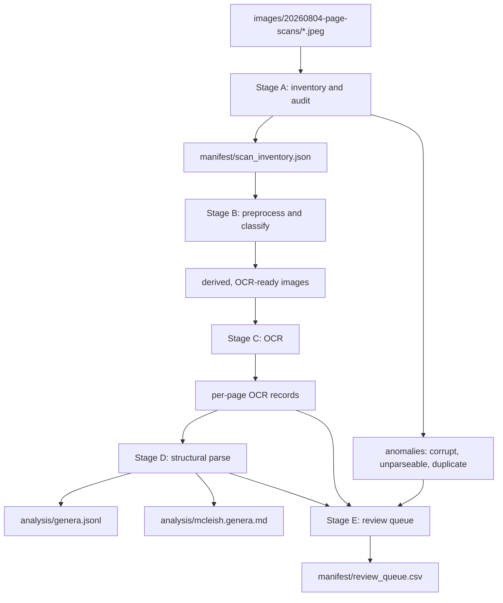

# Prototype 03, Phase 1: architecture and design

- [Prototype 03, Phase 1: architecture and design](#prototype-03-phase-1-architecture-and-design)
  - [Purpose](#purpose)
  - [1. Design principles](#1-design-principles)
  - [2. The pipeline, five stages](#2-the-pipeline-five-stages)
  - [3. Stage-by-stage narrative](#3-stage-by-stage-narrative)
    - [3.1 Stage A — inventory and audit](#3-1-stage-a—-inventory-and-audit)
    - [3.2 Stage B — preprocess and classify](#3-2-stage-b—-preprocess-and-classify)
    - [3.3 Stage C — OCR](#3-3-stage-c—-ocr)
    - [3.4 Stage D — structural parse](#3-4-stage-d—-structural-parse)
    - [3.5 Stage E — review queue](#3-5-stage-e—-review-queue)
  - [4. What gets parsed, and what doesn't](#4-what-gets-parsed-and-what-doesnt)
  - [5. Prove the approach, then scale it](#5-prove-the-approach-then-scale-it)
  - [6. What's not in this document](#6-whats-not-in-this-document)
  - [Metadata](#metadata)

## Purpose

How Phase 1 is built, at a level a botanist can follow without programming
knowledge. The module-by-module version, for an engineer, is the detailed
design document.

## 1. Design principles

Five rules run through every stage. They exist because prototype-01 and
prototype-02 each violated one of them and paid for it (see the problem
overview, §3):

1. **Never trust a filename alone.** `prototype-03/images/20260804-page-scans/`
   mostly carries correct page identities in its filenames, which is a real
   advantage over both prior capture sets — but "mostly" is a measured fact
   from spot-checking, not a guarantee, and the pipeline verifies rather
   than assumes it (a corrupt file with a plausible page name was found in
   five minutes of manual inspection; automated verification has to do at
   least that well across every file, not just the ones inspected by hand).
2. **Confidence is not a quality gate by itself.** Prototype-02 showed a
   badly wrong page (rotated 180°) can still average near-perfect OCR
   confidence. Acceptance always combines a confidence check with an
   independent structural check.
3. **Provenance travels with every fact.** A characteristic with no
   recorded source image and OCR confidence is not in the corpus — it's in
   the review queue.
4. **Generated and hand-edited files are never ambiguous.** Prototype-02's
   review found a defect where a human-editable CSV was silently
   overwritten by the next automated run. Every file this pipeline writes
   is either fully generated (rebuilt from source images and code, safe to
   delete and regenerate) or fully hand-edited (a control input, never
   touched by generation code) — never both, and which one it is is stated
   next to it in the data document.
5. **Prove the approach on a small, deliberately hard sample before running
   it at scale.** See §5.

## 2. The pipeline, five stages

| Stage | Purpose | Reused from prototype-02 | New here |
| --- | --- | --- | --- |
| A. Inventory & audit | Establish what actually exists: identity, checksum, dimensions, colorspace, anomalies | The *idea* of a manifest (`pages.json`) | Review state keyed by content checksum, not filename; anomalies recorded, never fatal |
| B. Preprocess & classify | Route each image to the right treatment before OCR | The flat-field/contrast-stretch recipe, applied only where the audit shows it's needed | Classification from the already-present JPEG colorspace tag, not a saturation search |
| C. OCR | Column-ordered text per page, with confidence | Column-discovery-by-gap; language correction disabled | Explicit accept/reject thresholds; confidence combined with structural checks |
| D. Structural parse | Genus/species segmentation and field extraction | The field vocabulary, validated against prototype-01's real corpus | The parser itself — no prior art in this repository |
| E. Review queue | Human adjudication of exactly what the pipeline couldn't resolve | The shape and spirit of `mcleish_review_queue` | Scoped to the residual only |



## 3. Stage-by-stage narrative

### 3.1 Stage A — inventory and audit

Walks every file in `images/20260804-page-scans/` once and records, per
file: byte size, SHA-256, pixel dimensions, colorspace, and a parsed
"claimed identity" — a page number, a front-matter label, a plate linked to
a page, or "unrecognized." Nothing is discarded here and nothing aborts the
pass: a file that's too small to be a real page, or whose name matches
nothing expected, is recorded as an anomaly and carried forward to the
review queue (design principle 1 and 4).

This stage is also where prototype-02's review-state defect is designed
out: whether a file has already been reviewed and accepted is tracked
against its checksum, not its filename or its position in a list, so
replacing a file's *content* (a rescan, a rotation fix) correctly resets its
review state, while renaming or reordering files does not lose one.

### 3.2 Stage B — preprocess and classify

Colour-plate images (`page-NNNp1/p2.jpeg`) and body-text pages already
arrive in different JPEG colorspaces — confirmed on every file sampled
during design (sRGB for plates, Gray for text) — so classification is
mostly a matter of reading that tag, cross-checked against the filename
convention as a defensive sanity check rather than the primary signal.
This is a real simplification against prototype-02's method, which had to
search for a saturation threshold because its phone captures arrived
uniformly in colour. It is not assumed to hold for every file without
checking: the audit reports the cross-check result, and any page that
disagrees goes to review rather than being silently classified either way.

Whether any image transform is needed at all before OCR is decided from
evidence, not habit: the same background-brightness and contrast
measurements prototype-02 used to verify its own recipe are run here first.
If they show these scans are already flat and well-lit enough for OCR
(plausible, given they arrive markedly higher-resolution and already
grayscale, unlike prototype-02's raw phone captures), no transform runs at
all. If they don't, prototype-02's documented recipe — flat-field division
for text, per-channel contrast-stretch for plates — is reused as-is; it is
proven, not reinvented.

### 3.3 Stage C — OCR

Runs Apple Vision text recognition over each text page, in the column-aware
reading order prototype-02 built: column count is discovered from the
distribution of each line's left edge rather than assumed, because assuming
two columns silently scrambles the three-column index into nonsense —
wrong-looking-right output, the most expensive kind of error to catch
later. Language correction stays disabled (requirements, §1.2).

Output per page is a structured record — lines, their column and vertical
position, per-line confidence — carrying the page's identity from Stage A
so every downstream fact can point back to it.

### 3.4 Stage D — structural parse

The genuinely new piece of this project: turning a page's column-ordered
text into genus and species records. It recognizes three structural
signals directly visible on the source pages (confirmed by inspection of a
sample page during design, e.g. page 50 — see the data document for the
sample):

1. **Genus headers** — a numbered, bold genus name and author
   (`18. Psilochilus Barb. Rodr.`) that starts a new genus record and whose
   number is cross-checked against the running head on the same and
   adjacent pages, since a genus's treatment can span more than one page.
2. **The closed field-label vocabulary** — `ETYMOLOGY`, `GENERAL
   DISTRIBUTION`, `DISTRIBUTION IN BELIZE`, `HABITAT`, `FLOWERING SEASON`,
   `NOTE`, and the descriptive paragraph's italic organ leads — mapped
   directly to record fields.
3. **Species entries nested under a genus** — binomial, author, publication,
   synonymy — kept as separate sub-records rather than folded into the
   genus-level description, so a genus's characteristics reflect what the
   genus-level prose actually says.

Anything the parser can't confidently segment — an ambiguous field
boundary, a genus header it isn't sure it found — is emitted with the
uncertainty recorded, and routed to Stage E rather than guessed.

### 3.5 Stage E — review queue

Collects everything upstream stages flagged — anomalous files, pages that
failed the Stage C accept checks, ambiguous Stage D segmentations — into one
table a person can work through, in the spirit of
`prototype-01/analysis/mcleish_review_queue.tsv` but scoped to the residual
rather than the whole corpus, since (unlike prototype-01) most pages here
are expected to resolve automatically.

## 4. What gets parsed, and what doesn't

Stage D runs only on genus-treatment pages. Front matter (title page,
dedication, table of contents, and so on) and colour plates are inventoried
in Stage A and preprocessed in Stage B if needed, but never sent to the
parser — they cannot structurally contain genus characteristic text. A
plate's association with its facing text page is recorded in the inventory
so a future, image-based phase of work could use it; Phase 1 does not
process the image content of a plate itself.

## 5. Prove the approach, then scale it

The externally reviewed lesson from prototype-02 (`prototype-02/doc/20260727-claude-opus-5-text-extraction-plan.md`)
was that a plan should "prove the approach, then produce the corpus" —
validate on a small, deliberately varied sample before trusting the same
rules across the whole capture. Phase 1 follows that structure directly: a
pilot run over a small set chosen to be *hard*, not representative — a
clean two-column text page, a page of front matter, a colour-plate pair, the
neighborhood around the corrupt `page-065 1.jpeg` stub, and `m276.jpeg` — is
reviewed by hand against its source images before the same pipeline is
authorized to run over the full 1–190 page range. See the implementation
plan document for exactly where this gate sits in the commit sequence.

## 6. What's not in this document

- Exact file formats and schemas: data document.
- Script names, function signatures, and the specific fixes carried over
  from prototype-02's defect list: detailed design document.
- The commit sequence, test plan, and pilot-gate mechanics: implementation
  plan document.

## Metadata

```text
generator-name: Claude Code
generator-version: Claude Sonnet 5
generator-model-token: claude-sonnet-5
generator-provider: Anthropic
generation-date: 2026-08-08
generator-responsibility: other
```
