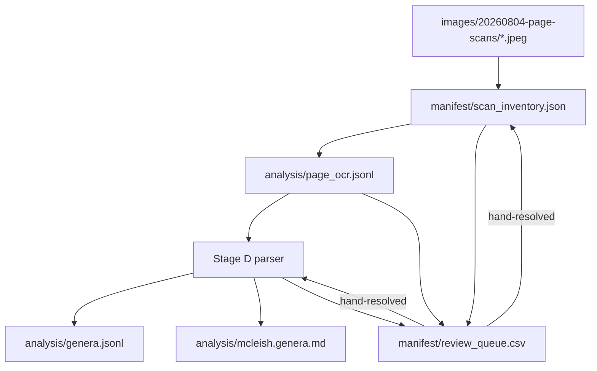

# Prototype 03, Phase 1: data formats and relationships

- [Prototype 03, Phase 1: data formats and relationships](#prototype-03-phase-1-data-formats-and-relationships)
  - [Purpose](#purpose)
  - [1. Source data: the scan directory](#1-source-data-the-scan-directory)
  - [2. `manifest/scan_inventory.json`](#2-manifestscan_inventoryjson)
  - [3. `manifest/review_queue.csv`](#3-manifestreview_queuecsv)
  - [4. `analysis/page_ocr.jsonl`](#4-analysispage_ocrjsonl)
  - [5. `analysis/genera.jsonl`](#5-analysisgenerajsonl)
  - [6. `analysis/mcleish.genera.md`](#6-analysismcleishgeneramd)
  - [7. Relationship diagram](#7-relationship-diagram)
  - [8. Generated vs. hand-edited](#8-generated-vs-hand-edited)
  - [Metadata](#metadata)

## Purpose

Every file Phase 1 reads or writes, its shape, and how the files relate to
each other. A botanist reviewing this project only needs §1 (what the raw
data looks like) and §6 (the human-readable output); the rest is for anyone
implementing or auditing the pipeline.

## 1. Source data: the scan directory

`images/20260804-page-scans/`, 243 files, read-only to every pipeline stage
(requirements, §3). Filenames observed fall into four patterns:

| Pattern | Example | Count (observed) | Meaning |
| --- | --- | --- | --- |
| `page-NNN.jpeg` | `page-050.jpeg` | 190 (pages 1–190, no gaps) | A body-text page |
| `page-NNNpK.jpeg` | `page-030p1.jpeg` | several pairs | Colour plate `K` associated with page `NNN` |
| named front matter | `titlepage.jpeg`, `toc-3.jpeg` | 14 | Title page, copyright, dedication, acknowledgments, foreword, preface (2), frontispiece (2), table of contents (5) |
| unrecognized | `m276.jpeg`, `page-065 1.jpeg` | 2 found so far | Anomalies — see requirements, §4, items 2–3 |

Typical body-text page: ~4350×6450 px, grayscale JPEG, ~640 dpi at the
book's trim size. Typical plate: ~5096×6600 px, sRGB. These are facts
established by direct inspection during design (`bin/imagemagick identify`
against a sample), not assumptions — the audit stage re-establishes them
for every file, not just the sample.

## 2. `manifest/scan_inventory.json`

Generated by Stage A. One entry per file in the scan directory; nothing is
excluded from this file, including anomalies.

Top level:

| Field | Type | Meaning |
| --- | --- | --- |
| `schema_version` | integer | |
| `generated_at` | string (timestamp) | |
| `source_directory` | string | |
| `image_count` | integer | |
| `entries` | array | one per file, see below |

Entry fields:

| Field | Type | Meaning |
| --- | --- | --- |
| `filename` | string | |
| `sha256` | string | content checksum — the review-state carry-forward key (architecture, §3.1) |
| `byte_size` | integer | |
| `width`, `height` | integer | pixel dimensions |
| `colorspace` | string | `Gray`, `sRGB`, or other, as reported by `identify` |
| `claimed_identity` | object | see below |
| `anomalies` | array of strings | e.g. `too_small`, `duplicate_of:<filename>`, `unparseable_filename`, `colorspace_mismatch` — empty when none found |
| `review_status` | string enum | `unreviewed`, `accepted`, `flagged`, `excluded` |
| `review_checksum` | string | the `sha256` the current `review_status` was recorded against; a changed checksum resets status to `unreviewed` |
| `remarks` | string | free text |

`claimed_identity` fields:

| Field | Type | Meaning |
| --- | --- | --- |
| `kind` | string enum | `page`, `front_matter`, `plate`, `unrecognized` |
| `page_number` | integer or null | for `kind: page` |
| `label` | string or null | for `kind: front_matter`, e.g. `titlepage` |
| `linked_page` | integer or null | for `kind: plate`, the page it's associated with |
| `plate_index` | integer or null | for `kind: plate`, 1 or 2 |

A human-editable CSV export of this file is a convenience view for review,
never an input — see §8.

## 3. `manifest/review_queue.csv`

Generated by Stage E from everything Stages A, C, and D flagged. Columns:

| Column | Meaning |
| --- | --- |
| `item_id` | stable identifier for this queue row |
| `kind` | `image_anomaly`, `ocr_reject`, or `parse_ambiguous` |
| `source_image` | filename(s) involved |
| `page_number` | where known |
| `reason` | which check failed, from a fixed vocabulary (e.g. `low_confidence`, `structural_mismatch`, `unparseable_filename`, `ambiguous_genus_boundary`) |
| `detail` | free text, enough for a person to act without opening the source file first |
| `status` | `open` or `resolved` |
| `resolution` | what was decided, once resolved |
| `resolved_by`, `resolved_date` | |

Resolving a row is a hand edit to this file (or, for §4 governance items, to
a small control file the detailed design document names) — it is the
project's equivalent of `prototype-01/analysis/mcleish_manual_overrides.json`.

## 4. `analysis/page_ocr.jsonl`

Generated by Stage C. One JSON object per line, one line per attempted
page.

| Field | Type | Meaning |
| --- | --- | --- |
| `page_id` | string | stable page identity from Stage A |
| `source_image` | string | filename |
| `columns` | integer | discovered column count |
| `lines` | array | `{text, confidence, column, min_x, mid_y}` per recognized line |
| `mean_confidence` | number | |
| `low_confidence_count` | integer | |
| `accept_status` | string | `accepted` or `rejected` |
| `reject_reasons` | array of strings | empty when accepted |

## 5. `analysis/genera.jsonl`

Generated by Stage D. One JSON object per genus record — the machine-
readable half of Phase 1's deliverable (problem overview, §5).

| Field | Type | Meaning |
| --- | --- | --- |
| `genus_id` | string | slug, e.g. `psilochilus` |
| `genus_name` | string | exactly as printed (requirements, §1.2) |
| `author` | string | as printed |
| `genus_number` | string | as printed, e.g. `"18"` |
| `source_pages` | array of integers | every page this genus's treatment spans |
| `fields` | object | keyed by the book's field labels (`ETYMOLOGY`, `HABITAT`, ...) and organ leads (`Roots`, `Leaves`, ...); each value is `{text, source_image, confidence, status}` |
| `species` | array | sub-records: `{species_name, author, publication, synonymy, fields}`, same field shape as above |
| `extraction_status` | string | `complete`, `partial`, or `needs_review` |
| `review_flags` | array of strings | references into `review_queue.csv` `item_id`s, where applicable |

A `fields` entry's `status` is `scored` when confidently extracted or
`uncertain` when it required a judgment call the parser wasn't confident
about — `uncertain` entries are also queued (§3), so a reader of this file
alone can tell what to trust without cross-referencing anything else.

## 6. `analysis/mcleish.genera.md`

Generated by Stage D from `genera.jsonl`, in the structural style of
`prototype-01/doc/mcleish.genera.md`: a table of contents, genus headings,
categorized bullet points under each. The one addition is a short source
line under each genus heading naming its source page(s), so a reader can go
back to the original scan for any fact. This file is what a botanist
actually reads; `genera.jsonl` exists for anything that needs to process
the corpus mechanically (Phase 2, most likely).

## 7. Relationship diagram



## 8. Generated vs. hand-edited

| File | Status |
| --- | --- |
| `manifest/scan_inventory.json` | Generated. Rebuilding it re-derives every field except `review_status`/`review_checksum`/`remarks`, which carry forward keyed on `sha256` (design principle 4, architecture document) |
| `manifest/review_queue.csv` | Generated rows, hand-edited resolution columns (`status`, `resolution`, `resolved_by`, `resolved_date`) — the tool that regenerates this file preserves those columns for rows it re-emits, the same carry-forward discipline as the inventory |
| `analysis/page_ocr.jsonl` | Fully generated. Delete and rebuild freely |
| `analysis/genera.jsonl` | Fully generated |
| `analysis/mcleish.genera.md` | Fully generated |

Nothing under `analysis/` is ever hand-edited; a correction goes into the
review queue and is re-applied on the next generation pass, the same
discipline `prototype-01/analysis/README.md` documents for its own
pipeline.

## Metadata

```text
generator-name: Claude Code
generator-version: Claude Sonnet 5
generator-model-token: claude-sonnet-5
generator-provider: Anthropic
generation-date: 2026-08-08
generator-responsibility: other
```
