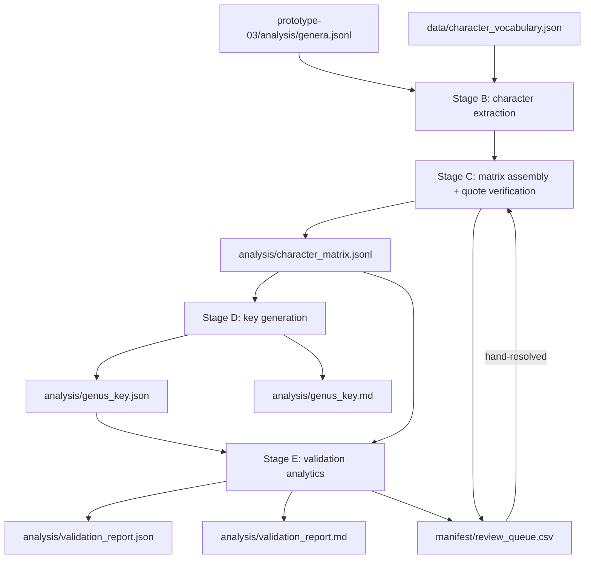

# Prototype 04, Phase 2: data formats and relationships

- [Prototype 04, Phase 2: data formats and relationships](#prototype-04-phase-2-data-formats-and-relationships)
  - [Purpose](#purpose)
  - [1. Source data: Phase 1's output](#1-source-data-phase-1s-output)
  - [2. `data/character_vocabulary.json`](#2-datacharacter_vocabularyjson)
  - [3. `analysis/character_matrix.jsonl`](#3-analysischaracter_matrixjsonl)
  - [4. `analysis/genus_key.json`](#4-analysisgenus_keyjson)
  - [5. `analysis/genus_key.md`](#5-analysisgenus_keymd)
  - [6. `analysis/validation_report.json`](#6-analysisvalidation_reportjson)
  - [7. `analysis/validation_report.md`](#7-analysisvalidation_reportmd)
  - [8. `manifest/review_queue.csv`](#8-manifestreview_queuecsv)
  - [9. Relationship diagram](#9-relationship-diagram)
  - [10. Generated vs. hand-curated](#10-generated-vs-hand-curated)
  - [Metadata](#metadata)

## Purpose

The exact shape of every file this phase reads or writes, and how they
relate — for whoever implements or extends this pipeline. A botanist does
not need this document; the results-summary document (produced at the end
of this phase, matching Phase 1's own) is written for that reader instead.

## 1. Source data: Phase 1's output

This phase's only input is `prototype-03/analysis/genera.jsonl`, read
strictly (requirements, §3: no modification of Phase 1's output). Its
schema is documented in prototype 03's own data document, §5 — this
document doesn't repeat it, only notes the fields this phase actually
uses: `genus_id`, `genus_name`, `fields` (keyed by organ lead or the
book's field labels, each `{text, source_image, confidence, status}`),
and `species[].fields` (not used by default — requirements, governance
question #3).

## 2. `data/character_vocabulary.json`

Hand-curated (architecture document, §4.1). Never written by this phase's
own code.

```json
{
  "schema_version": 1,
  "characters": [
    {
      "character_id": "lip_lobing",
      "label": "Lip lobing",
      "source_fields": ["Lip"],
      "states": [
        {"state_id": "entire", "label": "entire, not lobed"},
        {"state_id": "three_lobed", "label": "3-lobed"},
        {"state_id": "four_lobed", "label": "4-lobed"},
        {"state_id": "not_stated", "label": "not stated in the source text"}
      ]
    }
  ]
}
```

| Field | Type | Meaning |
| --- | --- | --- |
| `character_id` | string | stable slug, referenced by the matrix and the key |
| `label` | string | human-readable name |
| `source_fields` | array of strings | which Phase 1 field name(s) this character's evidence is normally found in — a hint to Stage B, not a hard restriction (a character's quote can come from `SUMMARY` too, per requirements §4 item 2) |
| `states` | array | every allowed value, **always including `not_stated`** (requirements, §1.5) |

## 3. `analysis/character_matrix.jsonl`

Generated by Stages B/C. One JSON object per genus — deliberately the same
shape convention as Phase 1's `genera.jsonl` (one record per genus, a
field-like object keyed by identifier, `{..., status}` per entry), so a
reader already familiar with Phase 1's output recognizes this immediately.

```json
{
  "genus_id": "psilochilus",
  "genus_name": "Psilochilus",
  "characters": {
    "lip_lobing": {
      "state_id": "three_lobed",
      "quote": "Lip free, 3-lobed; disc with 3 longitudinal calli.",
      "source_field": "Lip",
      "source_image": "page-050.jpeg",
      "confidence": 1.0,
      "status": "verified"
    },
    "pollinia_count": {
      "state_id": "not_stated",
      "quote": null,
      "source_field": null,
      "source_image": null,
      "confidence": null,
      "status": "not_stated"
    }
  },
  "review_flags": []
}
```

| Field | Type | Meaning |
| --- | --- | --- |
| `genus_id` / `genus_name` | string | carried from `genera.jsonl` unchanged |
| `characters` | object | one entry per `character_id` in the vocabulary — **every** genus record has **every** character key, even when its value is `not_stated` (requirements, §1.5: a matrix with missing columns per row is not acceptable) |
| `characters.*.status` | string | `verified` (quote checked, per architecture §3.3) or `not_stated` |
| `review_flags` | array of strings | item IDs into this phase's own `review_queue.csv` |

A `state_id` of anything other than `not_stated` always carries a
non-null `quote`/`source_field`/`source_image` — the same "trust nothing
without provenance" rule as Phase 1's `fields`, applied to `characters`
here.

## 4. `analysis/genus_key.json`

Generated by Stage D. A tree: each node is either a **split** (asks about
one character) or a **leaf** (names the genus or genera it resolves to).

```json
{
  "schema_version": 1,
  "root": {
    "type": "split",
    "character_id": "lip_lobing",
    "branches": [
      {
        "state_ids": ["three_lobed", "four_lobed"],
        "next": {"type": "leaf", "genus_ids": ["psilochilus"]}
      },
      {
        "state_ids": ["entire", "not_stated"],
        "next": {"type": "split", "character_id": "...", "branches": ["..."]}
      }
    ]
  }
}
```

A `leaf` with more than one `genus_id` is an ambiguous leaf (requirements,
§2) — the matrix didn't give the tree enough to separate them, and this
is where that fact is recorded structurally, not just in the validation
report (§6) that reports on it.

## 5. `analysis/genus_key.md`

Generated from `genus_key.json`, in the classic numbered-couplet style
McLeish's own dichotomous key to genera uses (real example, from the
book's pages 9-12: `"17. Pollinia naked, without caudicles or stipe" /
"Pollinia with definite caudicles or stipe"`, each lead pointing to
either another numbered couplet or a genus name). Using the same
convention the source book already uses is a deliberate, small piece of
usability (overview document, §3.3/§3.5: ease of use, parallelism) — a
reader of this output who has ever used a dichotomous key, including one
who has used *this specific book's* key, is already fluent in the format.
This is the document a botanist actually reads.

## 6. `analysis/validation_report.json`

Generated by Stage E.

```json
{
  "schema_version": 1,
  "self_consistency": {
    "total_genera": 69,
    "resolved_cleanly": 61,
    "in_ambiguous_leaf": 8,
    "failed": 0
  },
  "depth": {"mean": 4.2, "max": 9},
  "character_usage": {"lip_lobing": 61, "pollinia_count": 34},
  "ambiguous_leaves": [
    {
      "genus_ids": ["example_a", "example_b"],
      "shared_states": {"lip_lobing": "entire", "pollinia_count": "not_stated"}
    }
  ]
}
```

`self_consistency.failed` must be `0` for the key to be accepted
(requirements, §2) — any non-zero value here means the pipeline produced
output that fails its own acceptance floor and is not done, not a
number to report and move past.

## 7. `analysis/validation_report.md`

The same content as §6, rendered for a botanist: plain-language summary
of self-consistency, efficiency, character reliance, and — by genus
name, not just count — every ambiguous leaf and why it's ambiguous.
Follows the same "state coverage honestly, no implied completeness"
convention as `prototype-03/analysis/20260808-results-summary.md`.

## 8. `manifest/review_queue.csv`

Its own file under `prototype-04/manifest/`, not a shared file with
Phase 1's `prototype-03/manifest/review_queue.csv` — requirements §3
forbids writing into Phase 1's output directory. Same column shape and
carry-forward-by-`item_id` discipline as
`prototype-03/bin/export_review_queue.py`'s queue (prototype 03's data
document, §3), populated from Stage C's rejected proposals, Stage C's
all-`not_stated` genus rows, and Stage E's ambiguous leaves and
questionable splits (architecture document, §4.6).

## 9. Relationship diagram



## 10. Generated vs. hand-curated

| File | Status |
| --- | --- |
| `data/character_vocabulary.json` | Hand-curated. Never written by code — architecture document, design principle 4 |
| `analysis/character_matrix.jsonl` | Fully generated |
| `analysis/genus_key.json` | Fully generated |
| `analysis/genus_key.md` | Fully generated |
| `analysis/validation_report.json` | Fully generated |
| `analysis/validation_report.md` | Fully generated |
| `manifest/review_queue.csv` | Generated rows, hand-edited resolution columns carried forward by `item_id`, identical discipline to prototype 03's own review queue |

Nothing under `analysis/` is ever hand-edited; a correction to a
character-state assignment goes into the review queue, or — if it points
to a defect in the vocabulary itself — into a revision of
`data/character_vocabulary.json`, and is re-applied on the next
generation pass.

## Metadata

```text
generator-name: Claude Code
generator-version: Claude Sonnet 5
generator-model-token: claude-sonnet-5
generator-provider: Anthropic
generation-date: 2026-08-08
generator-responsibility: implementation
```
